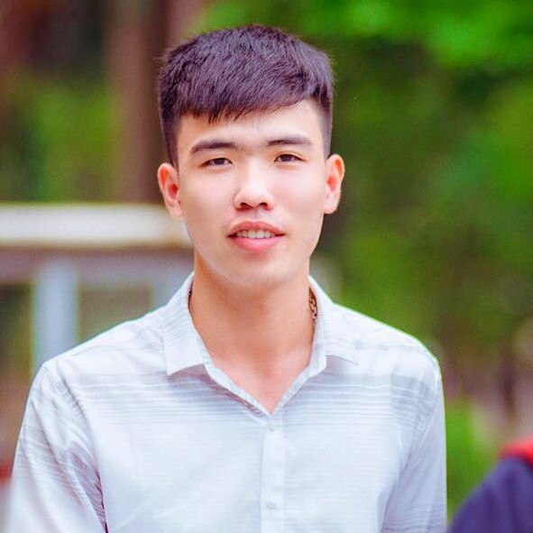

<h1 style="
  text-align: center;
  font-size: 40px;
">
Nguyen Trong Tai
</h1>

Web Junior Developer

<strong>Ha Noi, Viet Nam </strong> | <a href="callto::trongtaind37@gmail.com"> 0387689990</a> | <a href="mailto::trongtaind37@gmail.com"> trongtaind37@gmail.com</a>

## Objectives
I want to work in a professional programming environment, where I can develop professional skills, learn new programming knowledge to successfully complete the assigned work.

## Education
PSA (People Security Academy) - Sep, 2015 --> Sept, 2019
* Major: Information Technology
* GPA: 3.39/4

## Certifications
2017 - TOEIC Certificate with score 670 issued by IIG VIET NAM

## Honors and Awards
* 2016 - Third Prize in the Programming Olympiad Competition - PSA
* 2018 - Third Prize in the "Scientific Research Student Competition" issued by VIFOTEC

## Languagues and Skills 
* HTML5 & CSS3: 
* Vanilla JavaScript: 
* React & Redux: 
* Git & Github: 
* Networking: 
* Office: 
* Logical Thinking and Creative: 
* Teamwork Skills: 

## Interest
* Reading Blogs 
* Cinema
* Music

## Activities
THE ICPC INTERNATIONAL COLLEGIATE PROGRAMMING CONTEST, Nov, 2019 - Dec, 2019
* **MEMBER OF PSA TEAM** - 
The International Collegiate Programming Contest is an algorithmic programming contest for college students.
Teams of three, representing their university, work to solve the most real-world problems, fostering collaboration, creativity, innovation, and the ability to perform under pressure.

