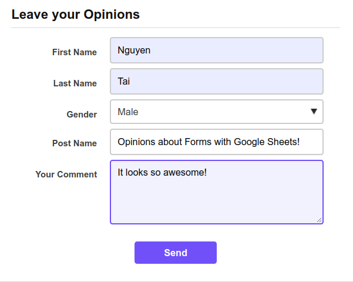
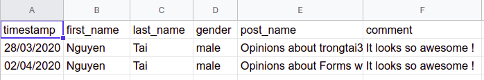

# Requirement and Motivation

On the way building and writing my blog, i wonder myself that can i get feedback from readers.
The idea is very simple but my blog is a static site, it has no server to handle and store the data from submitted form from users. 
So i need something like that, i just think about Google API and with some "doodle dood" in Google Search and finally I figure it out.

# Create a new Google Sheet

* First, go to [Google Sheet](https://docs.google.com/spreadsheets) and `Start a new spreadsheet` with the `blank` template.
* Rename it `Data from ...` or whatever you want :).
* Put the following header to the firt row:

|   |A          |B           |C          |D       |E          |F        | ... |
|---|:---------:|:----------:|:---------:|:------:|:---------:|:-------:|:----|
| 1 | timestamp | first_name | last_name | gender | post_name | comment | ... |

# Create a Google Apps Script

* Click on `Tools > Script Editor…` which should open a new tab.
* Rename it `Submit Form to Google Sheets`. _Make sure to wait for it to actually save and update the title before editing the script._
* Now, delete the `function myFunction() {}` block within the `Code.gs` tab.
* Paste the following script in it's place and `File > Save`:

```js
var sheetName = 'comment-data'
var scriptProp = PropertiesService.getScriptProperties()

function intialSetup () {
  var activeSpreadsheet = SpreadsheetApp.getActiveSpreadsheet()
  scriptProp.setProperty('key', activeSpreadsheet.getId())
}

function doPost (e) {
  var lock = LockService.getScriptLock()
  lock.tryLock(10000)

  try {
    var doc = SpreadsheetApp.openById(scriptProp.getProperty('key'))
    var sheet = doc.getSheetByName(sheetName)

    var headers = sheet.getRange(1, 1, 1, sheet.getLastColumn()).getValues()[0]
    var nextRow = sheet.getLastRow() + 1

    var newRow = headers.map(function(header) {
      return header === 'timestamp' ? new Date() : e.parameter[header]
    })

    sheet.getRange(nextRow, 1, 1, newRow.length).setValues([newRow])

    return ContentService
      .createTextOutput(JSON.stringify({ 'result': 'success', 'row': nextRow }))
      .setMimeType(ContentService.MimeType.JSON)
  }

  catch (e) {
    return ContentService
      .createTextOutput(JSON.stringify({ 'result': 'error', 'error': e }))
      .setMimeType(ContentService.MimeType.JSON)
  }

  finally {
    lock.releaseLock()
  }
}
```

# Run the setup function

* Next, go to `Run > Run Function > initialSetup` to run this function.
* In the `Authorization Required` dialog, click on `Review Permissions`.
* Sign in or pick the Google account associated with this projects.
* You should see a dialog that says `Hi {Your Name}`, `Submit Form to Google Sheets wants to`...
* Click `Allow`

# Add a new project trigger 
* Click on `Edit > Current project’s triggers`. 
* In the dialog click `No triggers set up. Click here to add one now.` 
* In the dropdowns select `doPost`
* Set the events fields to `From spreadsheet` and `On form submit`
* Then click `Save`

# Publish the project to handel the submitted form

* Click on `Publish > Deploy as web app…`.
* Set `Project Version` to `New` and put `initial version` in the input field below.
* Leave `Execute the app as:` set to `Me(your@address.com)`.
* For `Who has access to the app:` select `Anyone, even anonymous`.
* Click `Deploy`.
* In the popup, copy the `Current web app URL` from the dialog.
* And click `OK`.

# Prepare a form to submit your data

I create a form in React for user to submmit comment to me. All the data fields completely can be changed depends on you situation.

My React Form:

```jsx
<form name="submit-to-google-sheet" onSubmit={this.handleSubmitForm}>
  <div className="form-row">
    <label htmlFor="fisrt_name">First Name</label>
    <input
      value={this.state.formData.first_name} onChange={this.handleOnChange}
      name="first_name" type="text" placeholder="First Name" required
    />
  </div>
  <div className="form-row">
    <label htmlFor="last_name">Last Name</label>            
    <input
        value={this.state.formData.last_name} onChange={this.handleOnChange}
        name="last_name" type="text" placeholder="Last Name" required
      />          
  </div>
  <div className="form-row">
    <label htmlFor="gender">Gender</label>            
    <select name="gender" value={this.state.formData.gender} onChange={this.handleOnChange}>
        <option value="male">Male</option>
        <option value="female">Female</option>
        <option value="others">Others</option>
      </select>          
  </div>

  <div className="form-row">
    <label htmlFor="post_name">Post Name</label>            
    <input
        value={this.props.postName}
        name="post_name" type="text" placeholder="Post Name" readOnly
      />
  </div>

  <div className="form-row">
    <label htmlFor="comment">Your Comment</label>            
    <textarea
        value={this.state.formData.comment} onChange={this.handleOnChange}
        name="comment" type="text" placeholder="Your Comment"
      />          
  </div>

  <div className="form-row">
    <button type="submit">Send</button>
  </div>
</form>
```
and the `handleSubmit` function:

```js
handleSubmitForm = (e) => {
  e.preventDefault()

  const scriptURL = '[Your URL]';
  const form = document.forms['submit-to-google-sheet']

  fetch(scriptURL, { method: 'POST', body: new FormData(form) })
    .then(response => {
      this.setState({
        isSubmitted: true,
      })
      console.log('Success!', response);
    })
    .catch(error => {
      console.error('Error!', error.message);
    })
}
```

As you can see, this script uses the the [Fetch API](https://developer.mozilla.org/en-US/docs/Web/API/Fetch_API), a fairly new promise-based mechanism for making web requests. It makes a "POST" request to your script URL and uses [FormData](https://developer.mozilla.org/en-US/docs/Web/API/FormData) to pass in our data as URL paramters.

And from now, when you submit your comment in my blog, it's automatically submitted and stored in my spreedsheet like the screenshots below!




### Nice Practice!
